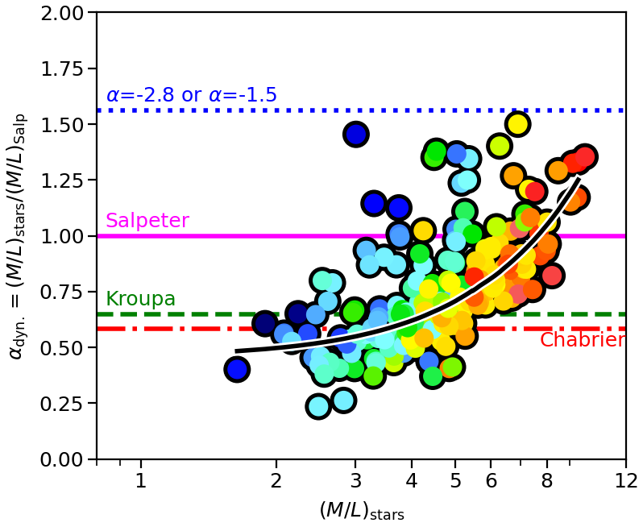
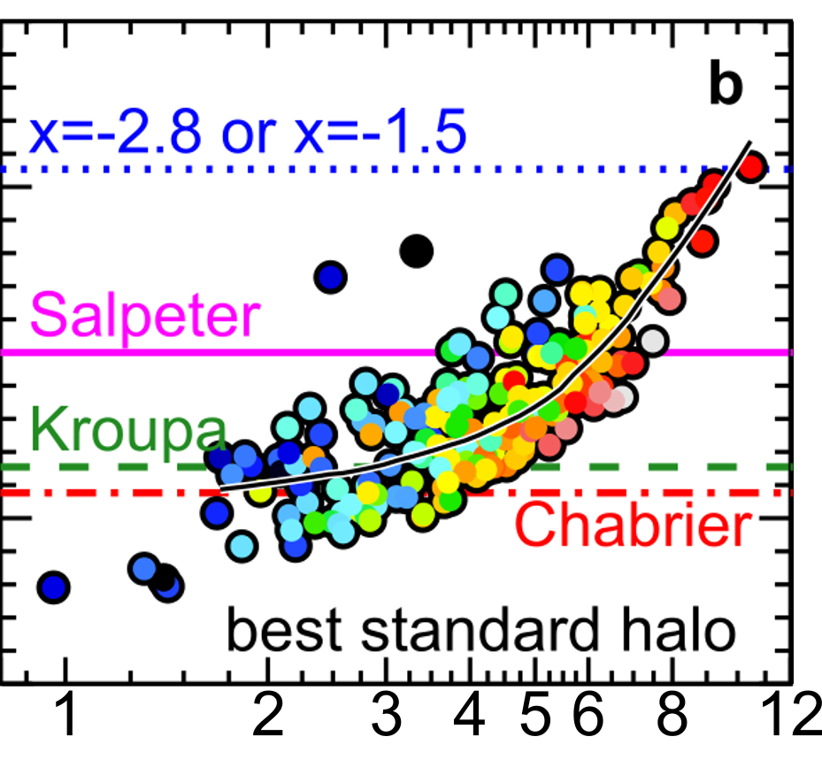
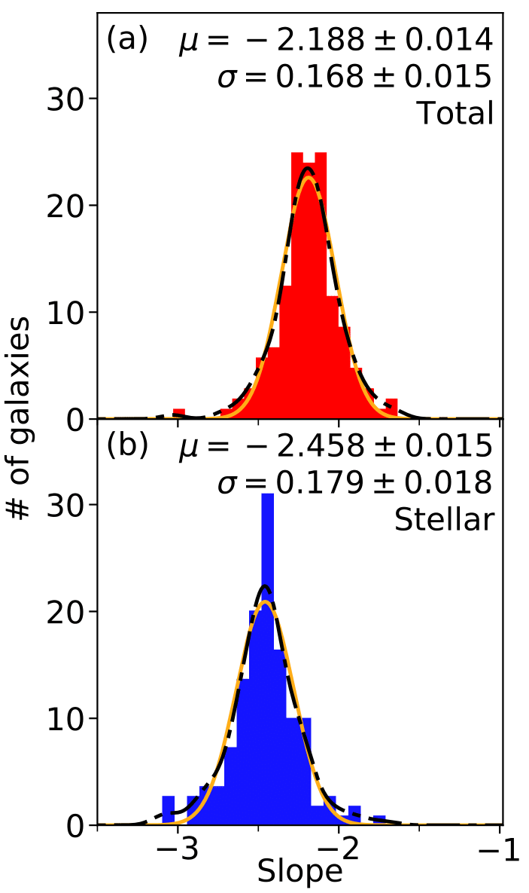

## <u>Current Research

Currently I am working on developing a self-consistent comprehensive galaxy formation model that combines triaxial orbit-superposition Schwarzschild dynamical models with full-spectral-fitting stellar-population analyses. The combination provides unprecidented archeological constraints on the formation and evoluion of nearby galaxies. Not only does this method bridge the once-independent field of stellar populations and stellar kinematics, but there is a heavy emphasis on maintaining self-consistency (for instance, see earlier research below).   
A first application of this methodology was published in [Poci et al. (2019)](https://ui.adsabs.harvard.edu/abs/2019MNRAS.487.3776P/abstract). I am now working on extending and applying this model to data from the [Fornax3D survey](http://www.na.astro.it/Fornax3D/Fornax3D/Welcome.html).

## Past Research

Earlier work was focused on investigating the impact of including the derived stellar mass-to-light ratio <MATH>(M&#9733;/L)</MATH> into dynamical models, in order to relax the assumption of a spatially-constant <MATH>(M&#9733;/L)</MATH> of most previous implementations. This work used the Jeans Anisotropic Model ([JAM](http://www-astro.physics.ox.ac.uk/~mxc/software/); [Cappellari, 2008](https://ui.adsabs.harvard.edu/abs/2008MNRAS.390...71C/abstract)).   
The results of that work were two-fold;

<h4>&alpha;dyn. Mismatch</h4>

Testing the impact of including a spatially-varying <MATH>(M&#9733;/L)</MATH> on the inferred dynamical mismatch parameter, &alpha;dyn.. This parameter measures the offset between the dynamically-inferred and stellar-population-inferred galaxy mass, in effect constraining the accuracy of the assumed stellar Initial Mass Function (IMF). The case with the spatially-varying <MATH>(M&#9733;/L)</MATH> from my work is shown on the left, while the original result, for a spatially-constant <MATH>(M&#9733;/L)</MATH>, is shown on the right (<a href="https://ui.adsabs.harvard.edu/abs/2012Natur.484..485C/abstract">Cappellari et al., 2012</a>). This result shows that, while the dynamical models with a spatially-varying <MATH>(M&#9733;/L)</MATH> exhibit a systematic offset to lower &alpha;dyn. values, importantly the non-linear trend with mass remains. This was the main goal of my <a href="http://hdl.handle.net/1959.14/1185049">Master's Thesis</a>.

<h4>Total-Mass Density Profile Slopes</h4>

In addition to IMF constraints, and owing to the specific dynamical model that was employed for the above result, we found interesting correlations with the total (dynamical) mass of galaxies. Rather than applying some baryonic+dark mass model, which requires assumptions about both the baryonic and dark-matter distributions, we constrain the total dynamical mass directly with our models. This allows for robust measurements of the profile of the total-mass density, constrained directly by the observed kinematics. Most notably, we find that the distribution of slopes of the profiles of the total-mass density is more concentrated than that of the stellar-mass density, and is centred on a nearly-isothermal value of <MATH>&gamma;tot. &sim; -2.1</MATH> (<a href="https://ui.adsabs.harvard.edu/abs/2017MNRAS.467.1397P/abstract">Poci et al., 2017</a>).

These total-mass density slopes were also found to correlate with a number of other physical properties of galaxies. the strongest such correlation was found to be with the central velocity dispersion (within <MATH>1 Re</MATH>), <MATH> &sigma;e</MATH>, illustrated here. This correlation is interesting because it shows a clear transition at <MATH> <mrow><msub><mi>log</mi><mn>10</mn></msub><mo>&#x2061;<!--FUNCTION APPLICATION--></mo>(<mi>&sigma;e</mi>)</mrow> &sim; -2.1</MATH>.

<a href="../assets/plSlopeSigma-bpl-MI.pdf"><object data="../assets/plSlopeSigma-bpl-MI.pdf" type="application/pdf" width="860">
  
It appears there is no PDF plugin for this browser. <a href="../assets/plSlopeSigma-bpl-MI.pdf">Click here to
    view the plot.</a>
  

</object></a>

<!-- Note: this is how to write a comment in HTML. Everything in here won't show up on your webpage.-->

<!--
To increase the size of the title, use fewer # in front of the paper title.
To decrease the size of the title, use more #. 
To remove the italics, remove the * before and after the description
To remove the underline from the title, remove the <u> tags (<u> and </u>)
-->